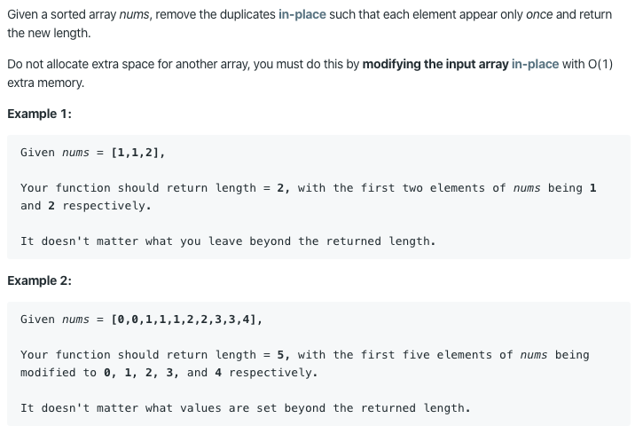

26. Remove Duplicates from Sorted Array

https://leetcode.com/problems/remove-duplicates-from-sorted-array/

Runtime: 1 ms, faster than 97.85% of Java online submissions for Remove Duplicates from Sorted Array.

Memory Usage: 39.9 MB, less than 79.26% of Java online submissions for Remove Duplicates from Sorted Array.