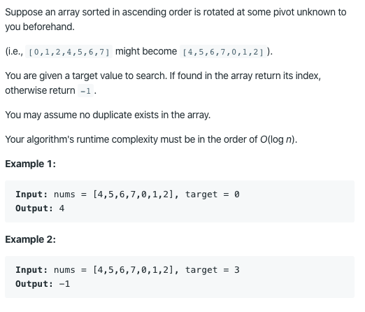

# 33. Search in Rotated Sorted Array

https://leetcode.com/problems/search-in-rotated-sorted-array/

Runtime: 0 ms, faster than 100.00% of Java online submissions for Search in Rotated Sorted Array.

Memory Usage: 40.6 MB, less than 6.92% of Java online submissions for Search in Rotated Sorted Array.
