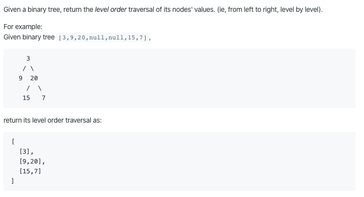

# 102. Binary Tree Level Order Traversal

https://leetcode.com/problems/binary-tree-level-order-traversal/

Runtime: 1 ms, faster than 89.00% of Java online submissions for Binary Tree Level Order Traversal.

Memory Usage: 36.4 MB, less than 100.00% of Java online submissions for Binary Tree Level Order Traversal.