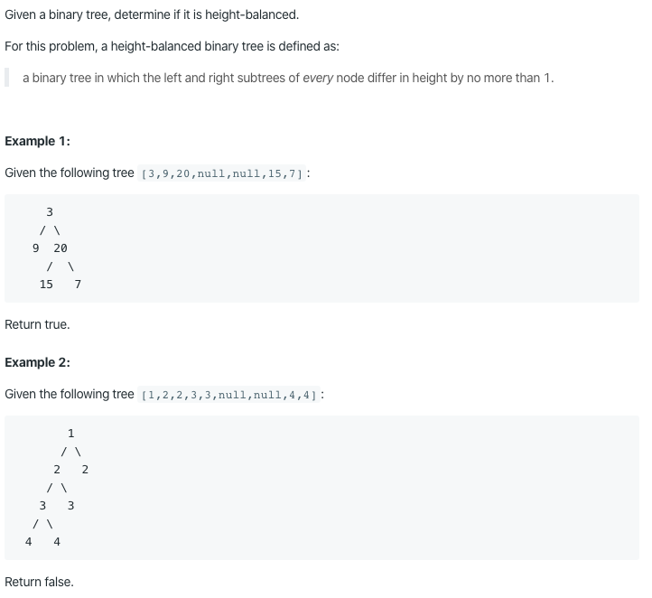

# 110. Balanced Binary Tree

https://leetcode.com/problems/balanced-binary-tree/

Runtime: 1 ms, faster than 99.85% of Java online submissions for Balanced Binary Tree.

Memory Usage: 36.9 MB, less than 100.00% of Java online submissions for Balanced Binary Tree.
