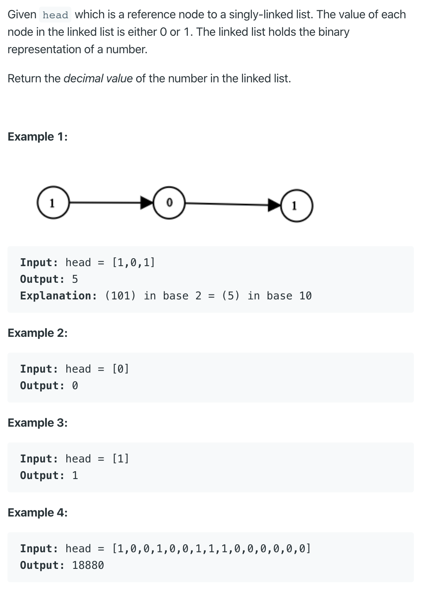

# 1290. Convert Binary Number in a Linked List to Integer

https://leetcode.com/problems/convert-binary-number-in-a-linked-list-to-integer/

Runtime: 0 ms, faster than 100.00% of Java online submissions for Convert Binary Number in a Linked List to Integer.

Memory Usage: 34.1 MB, less than 100.00% of Java online submissions for Convert Binary Number in a Linked List to Integer.