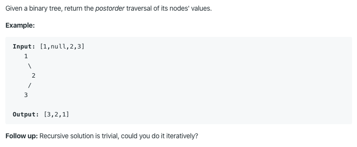

# 145. Binary Tree Postorder Traversal

https://leetcode.com/problems/binary-tree-postorder-traversal/

Runtime: 0 ms, faster than 100.00% of Java online submissions for Binary Tree Postorder Traversal.

Memory Usage: 35 MB, less than 100.00% of Java online submissions for Binary Tree Postorder Traversal.
