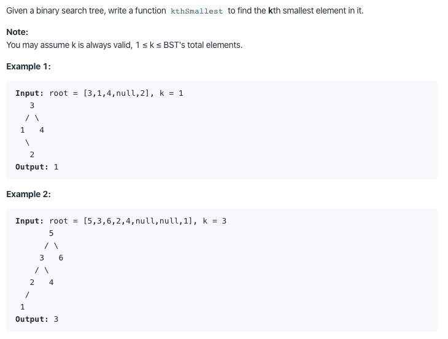

# 230. Kth Smallest Element in a BST

https://leetcode.com/problems/kth-smallest-element-in-a-bst/

Runtime: 0 ms, faster than 100.00% of Java online submissions for Kth Smallest Element in a BST.

Memory Usage: 37.3 MB, less than 100.00% of Java online submissions for Kth Smallest Element in a BST.
