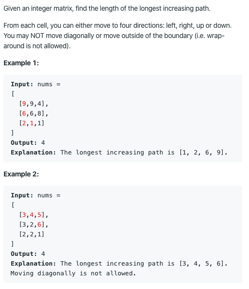

# 329. Longest Increasing Path in a Matrix

https://leetcode.com/problems/longest-increasing-path-in-a-matrix/

Runtime: 15 ms, faster than 27.06% of Java online submissions for Longest Increasing Path in a Matrix.

Memory Usage: 38.8 MB, less than 100.00% of Java online submissions for Longest Increasing Path in a Matrix.