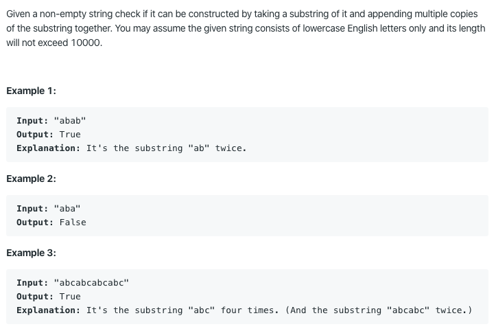

# 459. Repeated Substring Pattern

https://leetcode.com/problems/repeated-substring-pattern/

Runtime: 44 ms, faster than 69.23% of Java online submissions for Repeated Substring Pattern.
Memory Usage: 38.3 MB, less than 76.19% of Java online submissions for Repeated Substring Pattern.
