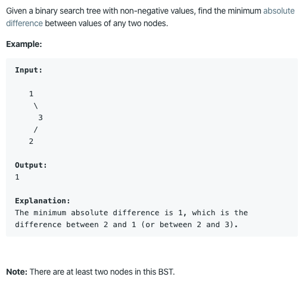

# https://leetcode.com/problems/minimum-absolute-difference-in-bst/

https://leetcode.com/problems/minimum-absolute-difference-in-bst/

Runtime: 0 ms, faster than 100.00% of Java online submissions for Minimum Absolute Difference in BST.

Memory Usage: 38.4 MB, less than 100.00% of Java online submissions for Minimum Absolute Difference in BST.
