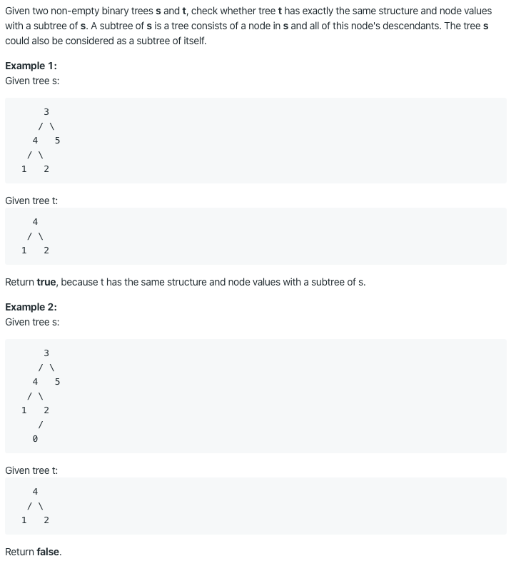

# 572. Subtree of Another Tree

https://leetcode.com/problems/subtree-of-another-tree/

Runtime: 6 ms, faster than 92.31% of Java online submissions for Subtree of Another Tree.

Memory Usage: 39.9 MB, less than 100.00% of Java online submissions for Subtree of Another Tree.
