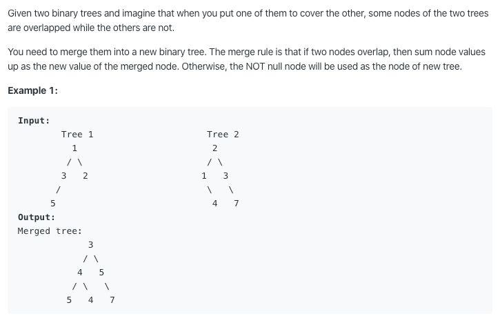

# 617. Merge Two Binary Trees

https://leetcode.com/problems/merge-two-binary-trees/

Runtime: 0 ms, faster than 100.00% of Java online submissions for Merge Two Binary Trees.

Memory Usage: 40.3 MB, less than 100.00% of Java online submissions for Merge Two Binary Trees.
