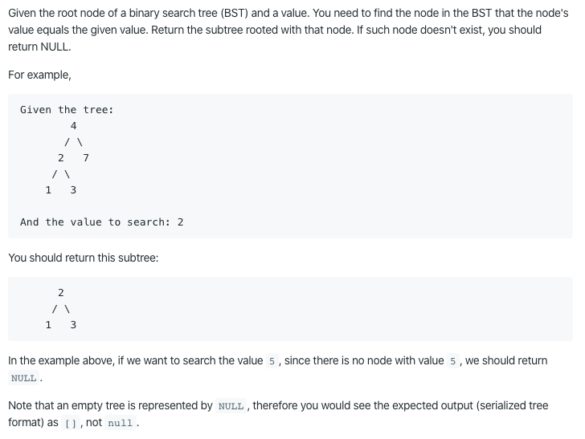

700. Search in a Binary Search Tree

https://leetcode.com/problems/search-in-a-binary-search-tree/

Runtime: 0 ms, faster than 100.00% of Java online submissions for Search in a Binary Search Tree.

Memory Usage: 38.6 MB, less than 100.00% of Java online submissions for Search in a Binary Search Tree.