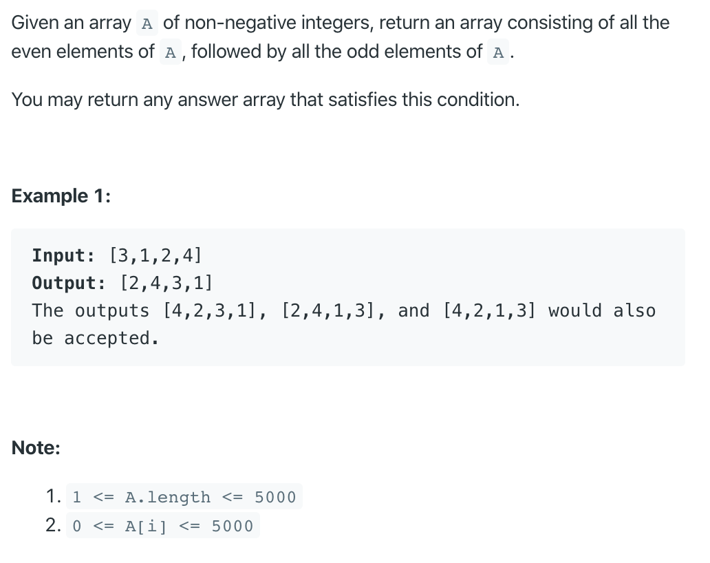

# 905. Sort Array By Parity

https://leetcode.com/problems/sort-array-by-parity/

Runtime: 1 ms, faster than 100.00% of Java online submissions for Sort Array By Parity.

Memory Usage: 40 MB, less than 95.14% of Java online submissions for Sort Array By Parity.