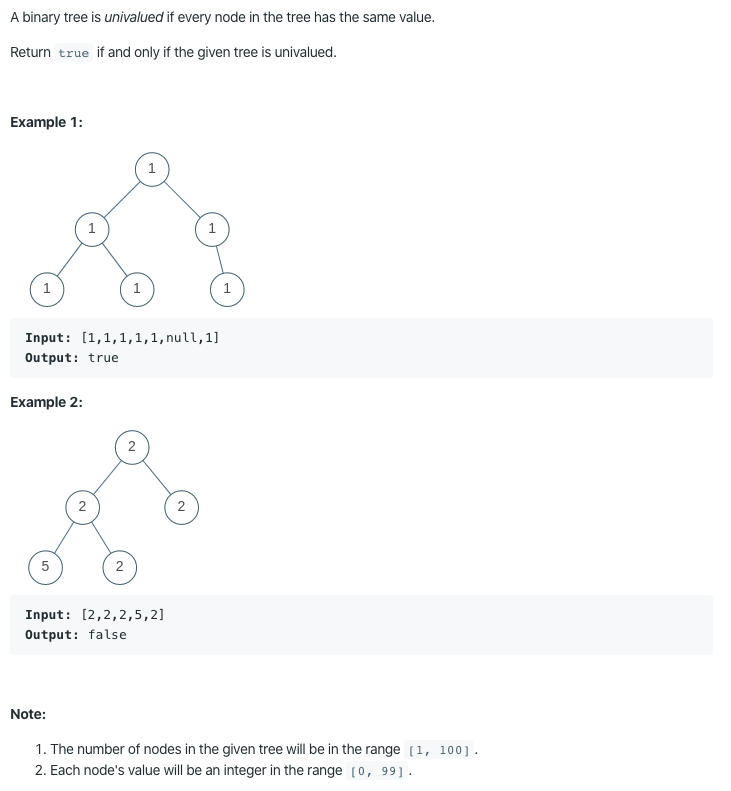

965. Univalued Binary Tree

https://leetcode.com/problems/univalued-binary-tree/

Runtime: 0 ms, faster than 100.00% of Java online submissions for Univalued Binary Tree.

Memory Usage: 34.4 MB, less than 100.00% of Java online submissions for Univalued Binary Tree.
