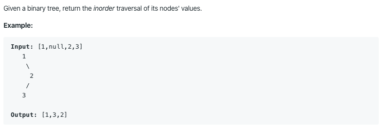

# 94. Binary Tree Inorder Traversal

https://leetcode.com/problems/binary-tree-inorder-traversal/

Runtime: 0 ms, faster than 100.00% of Java online submissions for Binary Tree Inorder Traversal.

Memory Usage: 34.9 MB, less than 100.00% of Java online submissions for Binary Tree Inorder Traversal.
