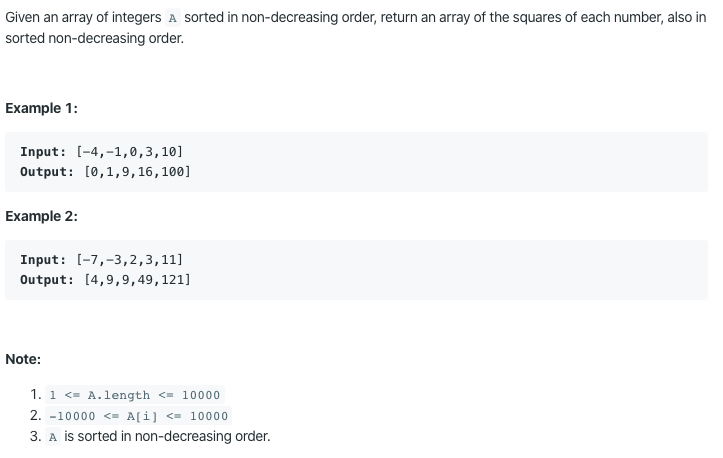

977. Squares of a Sorted Array

https://leetcode.com/problems/squares-of-a-sorted-array/

Runtime: 1 ms, faster than 100.00% of Java online submissions for Squares of a Sorted Array.

Memory Usage: 41.1 MB, less than 95.73% of Java online submissions for Squares of a Sorted Array.
